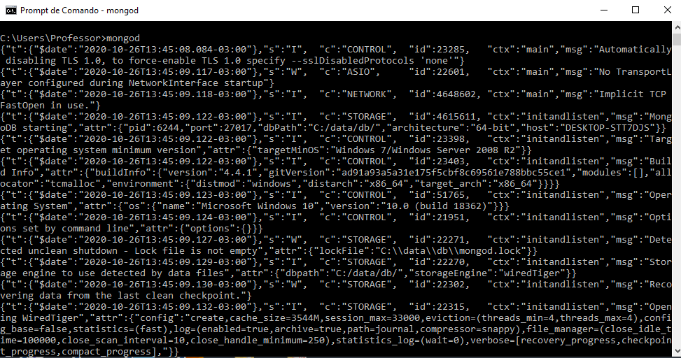
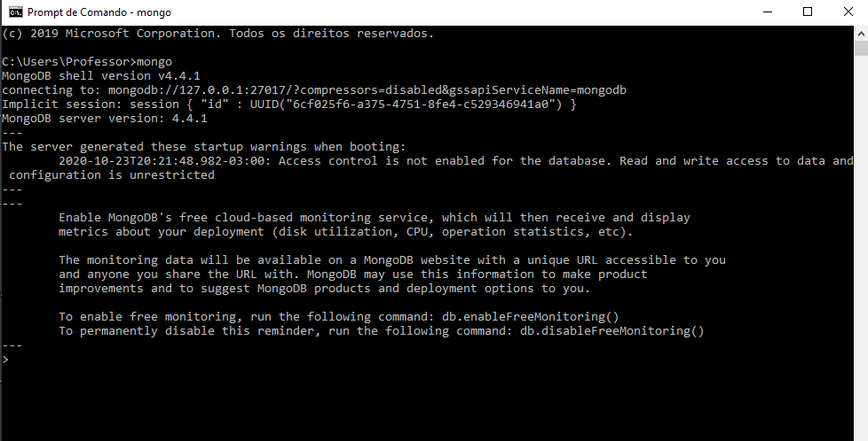

### atividade-semana12
  

# Banco de dados

 

Bancos de dados ou bases de dados são conjuntos de arquivos relacionados entre si com registros sobre pessoas, lugares ou coisas.

São coleções organizadas de dados que se relacionam de forma a criar informações capazes dar mais eficiência durante uma pesquisa, análise ou estudo cientifico.

As bases de dados são de vital importância para empresas e são utilizadas para armazenar diversos tipos de informações, desde dados sobre uma conta de e-mail até dados importantes da Receita Federal. A principal aplicação de Banco de Dados é o controle de operações empresariais.

De forma simplificada, podemos dizer que um banco de dados é uma coleção de dados que devem ser armazenados ou persistidos. Em um banco de dados, as informações são gravadas em memórias de longo prazo e mesmo que o computador seja desligado, os dados não serão perdidos. Dizemos que esses dados persistem.

Existe uma distinção entre banco de dados e sistema gerenciador do banco de dados (SGBD). 

Um Sistema de Gerenciamento de Banco de Dados (SGBD) é o conjunto de softwares responsáveis pelo gerenciamento de um banco de dados. Seu principal objetivo é retirar da aplicação cliente a responsabilidade de gerenciar o acesso, a persistência, a manipulação e a organização dos dados.

 

# Entidades e Atributos

 

Uma entidade é uma representação de um conjunto de informações sobre determinado conceito. Toda entidade possui atributos, que são as informações que referenciam a entidade. Uma entidade é representada por um conjunto de atributos.

Para saber se determinado conceito pode ser uma entidade ou não, basta se  perguntar: " Desejo armazenar quais informações sobre este conceito? ". Se houverem informações a serem armazenadas, você tem uma entidade. 

Vamos apresentar dois exemplos. Primeiro exemplo, desejamos armazenar os seguintes dados do livro: Título, Autor, Editora, Ano, Edição e Volume. Logo , temos a entidade Livro.

Desejamos armazenar os seguintes dados sobre a pessoa: Nome, Data de nascimento, Filiação, Sexo, RG, CPF e Grau de escolaridade. Então, temos a entidade pessoa. 

 

# Sistemas de Gerenciamento de Banco de Dados

 

Os SGBDs são utilizados para gerir as estruturas de armazenamento dos dados, permitindo a realização de manipulações, bem como o controle das permissões de utilização dos bancos de dados.

Todas as organizações possuem quantidades cada vez maiores de dados e informações a serem armazenadas. Porém, a manipulação dessas informações tornou-se impossível de ser realizada manualmente, pois sua utilização, além de demorada devido a catalogação dos dados, é passível de erros, principalmente ocasionados pelo desgaste do operador em conseguir resgatar informações requisitadas.

Qualquer empresa que pretenda garantir um controle efetivo sobre todo o seu negócio tem que recorrer a sistemas de gestão de bases de dados. Nesse sentido, torna-se mais fácil encontrar a informação em uma base de dados baseada em uma tecnologia mais confiável - o computador. 

## Exemplos de SGBDs:

- PostgreSQL;  
- MySQL; 
- Oracle; 
- MongoDB; 
- MariaDB; 
- Microsoft SQL Server, dentre outros.  
 

 

O MongoDB é um software não relacional de banco de dados orientado a documentos livre, de código aberto e multiplataforma, escrito na linguagem C++.

Como dito anteriormente, é classificado como um programa de banco de dados NoSQL (não relacional) e usa documentos semelhantes a JSON com esquemas. 

Um banco de daos NoSQL permite adicionar novos campos; expandindo desta forma o banco de dados livremente e com campos diferentes.

Um registro no MongoDB é um documento, que é uma estrutura de dados composta de pares de campo e valor.

Os documentos do MongoDB são semelhantes aos objetos JSON. O MongoDB armazena documentos em coleções.

O MongoDB oferece uma versão Community totamente gratuita e disponível para Windows, Linux e MacOS.

 

## Instalação e Tutorial

 

A instalação do MongoDB Community versão gratuita e atualizada para Windows pode ser feita na url abaixo:

[Download do MongoDB Community]( https://www.mongodb.com/try/download/community )

Assista a um tutorial explicativo para configurar adequadamente seu MongoDB: 

[Instalando e configurando o MongoDB no Windows](https://www.youtube.com/watch?v=skK5xj-CK-Q)

 

## Comandos utilizados no MongoDB no Prompt de Comando (cmd) :

- Digite : mongod - no terminal/prompt de comando (cmd) para subir o servidor .

 

 

- Digite : mongo  - em um outro prompt de comando (cmd) e o utilize para inserção dos comandos para criação do banco de dados e manipulação dos dados.

 

   

Estes dois terminais deverão estar abertos simultâneamente. As imagens mostram o que deverá estar sendo exibido nos prompts de comandos para validar a instalação exitosa.

## Comandos do MongoDB :
 

1. Para criação de um Banco de dados:
 

- 
use [ nomeDoBancoASerCriado ]

2. Para mostrar seus bancos de dados

- 
show databases

3. Para criar uma collection :

- 
db.createCollection( "nomeDaCollection" )

O comando apresentado agora não deverá ser executado a menos que deseje, de fato, apagar o seu banco de dados. Está sendo apresentado apenas com fins de aprendizagem. TENHA CUIDADO COM ESTE COMANDO!
 

4. Para DELETAR todos os bancos :

- 
db.dropDatabase( ) 

5. Para mostrar todas as collections :

- 
show collections

6. Exibe registros :

- 
db.nomeDaCollection database

7. Comando que mostra o banco que está sendo usado no momento :

- 
db.current 

8. Saia do Shell

- 
quit ( )  ou  Ctrl + C

9. Seleciona todos os documentos em uma coleção e os retorna.

- 
db.nomeDaCollection.find ( )

10. Comando que retorna um documento que satisfaz os critérios de consulta especificados na coleção. Se vários documentos satisfizerem a consulta, este método retornará o primeiro documento de acordo com a ordem natural que reflete a ordem dos documentos no disco, isto, retorna um único registro. 

- 
db.nomeDaCollection.findOne ( )

11. Insere um documento ou documentos em uma coleção.

    
- 
db.nomeDaCollection.insert( )

O insert( ) método possui a seguinte sintaxe : db.nomeDaCollection.insert (
    {
     " nome " : "Simone",
     " feliz " :  true
    }
)

12. Comando para trazer o retorno de uma forma
mais amigável:

- 
db.nomeDaCollection.find( ).pretty( )

13. Comando para incluir um registro dentro de uma collection:

- 
db.nomeDaCollection.insertOne( {atributos} )

Exemplo : db.nomeDaCollection.insertOne( {  "item" :  "cartão" ,  "qtd" :  15  }  )

14. Comando para incluir vários registros de uma única vez:

- 
db.nomeDaCollection.insertMany( [ { objetos } ] )

O insertMany( ) método possui a seguinte sintaxe:

db.nomeDaCollection.insertMany ( 
   [  < documento  1 >  ,  < documento  2 > ,  ...  ], 
   { 
      " numero " :  56, 
      " ordenado " : true 
   } 
)

 

Para informações sobre mais comandos ou informações mais detalhadas e completas, consulte a bíblia abaixo :

[Manual do MongoDB 4.4]( https://docs.mongodb.com/manual/ )

 

Referências bibliográficas:

 

[Wikipedia](https://pt.wikipedia.org/wiki/Banco_de_dados#Bases_de_Dados_Relacionais)

[Blog Gran Cursos Online](https://blog.grancursosonline.com.br/conceito-de-banco-de-dados/)

 

#### Por : Inácia Simone da Silva - Aluna da Turma Back-end Porto-MINAs 2020.2

